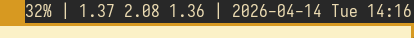

# mindwmstat

[](https://builds.sr.ht/~kovmir/mindwmstat/commits/master/.build.yml?)

Minimal [dwm](https://dwm.suckless.org/) status bar

# PREVIEW

```
 +---- RAM Usage
 |
 v
32% | 1.37 2.08 1.36 | 2026-04-14 Tue 14:16
             ^                   ^
             |                   |
         CPU Load            Date & Time
```



# INSTALL

```sh
git clone https://git.sr.ht/~kovmir/mindwmbar
cd mindwmbar
make
sudo make install
```

Use `make CONSOLE=1` for console output or `ANIMATION=1` to add status bar
animation to see whether it updates and how quickly.

# USAGE

```sh
mindwmbar # Put 'mindwmbar &' in your '~/.xinitrc'.
```

# DEPENDENCIES

* [GNU Make](https://www.gnu.org/software/make/)
* [pkg-config](https://gitlab.freedesktop.org/pkg-config/pkg-config)
* [GCC](https://gcc.gnu.org/) or [Clang](https://clang.llvm.org/)
* [Xlib](https://www.x.org/releases/current/doc/libX11/libX11/libX11.html)

# CONTRIBUTING

When submitting PRs, please maintain the [coding
style](https://suckless.org/coding_style/) used for the project.
