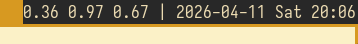

# mindwmstat

Minimal [dwm](https://dwm.suckless.org/) status bar

# PREVIEW

```
 +---- RAM Usage                            Battery
 |                                             |
 v                                             v
15% | 0.00 0.01 0.02 | 2026-04-15 Wed 09:31 | ^92%
           ^                   ^              ^
           |                   |              |
       CPU Load            Date & Time     AC Plug
```



*Power indicator disappears on non–battery-powered devices.*

# INSTALL

```sh
git clone https://github.com/kovmir/mindwmstat.git
cd mindwmstat
make # Optionally adjust config.h to your liking.
sudo make install
```

# USAGE

```sh
mindwmstat # Put 'mindwmbar &' in your '~/.xinitrc'.
```

# DEPENDENCIES

* [Git](https://git-scm.com/)
* [GNU Make](https://www.gnu.org/software/make/)
* [pkg-config](https://gitlab.freedesktop.org/pkg-config/pkg-config)
* [GCC](https://gcc.gnu.org/) or [Clang](https://clang.llvm.org/)
* [Xlib](https://www.x.org/releases/current/doc/libX11/libX11/libX11.html)

# SUPPORTED OS

* Linux

# CONTRIBUTING

When submitting PRs, please maintain the [coding
style](https://suckless.org/coding_style/) used for the project.
